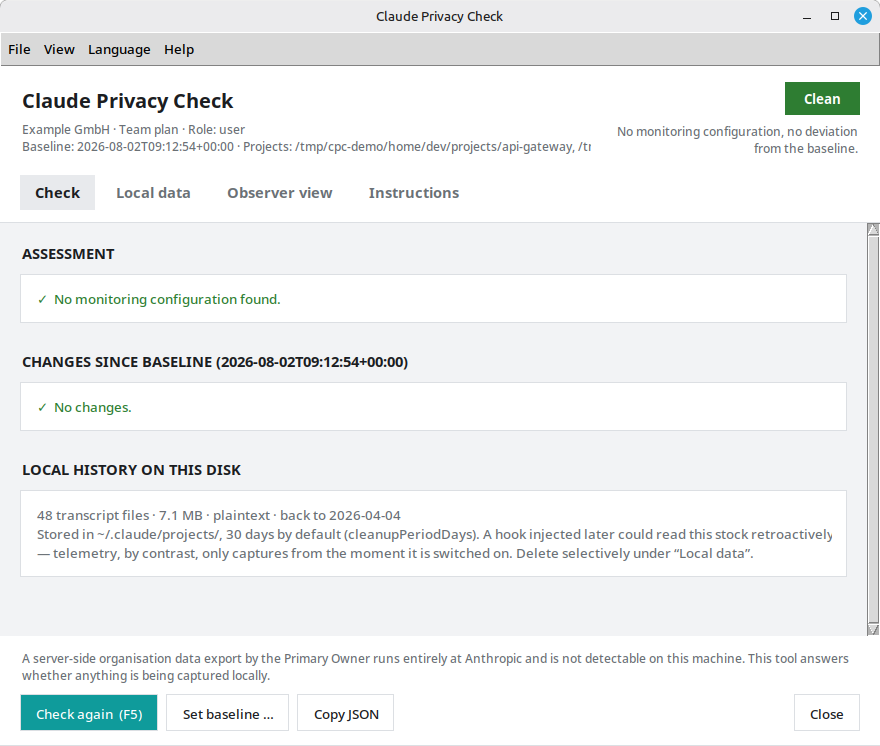
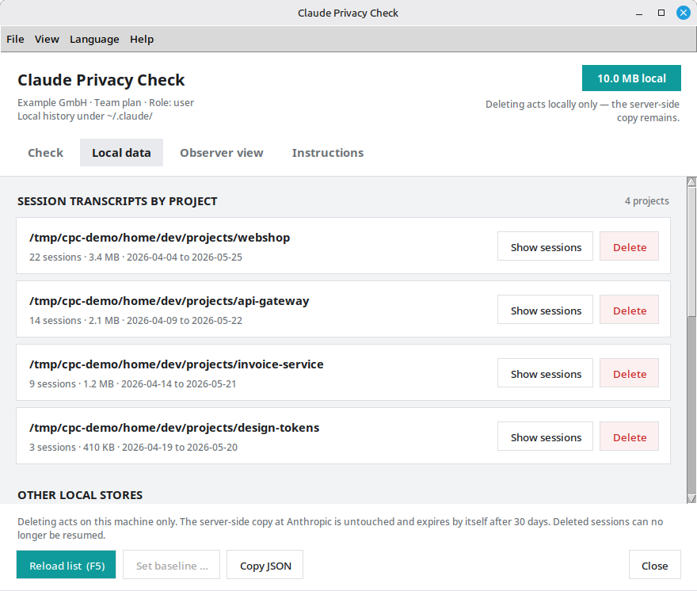
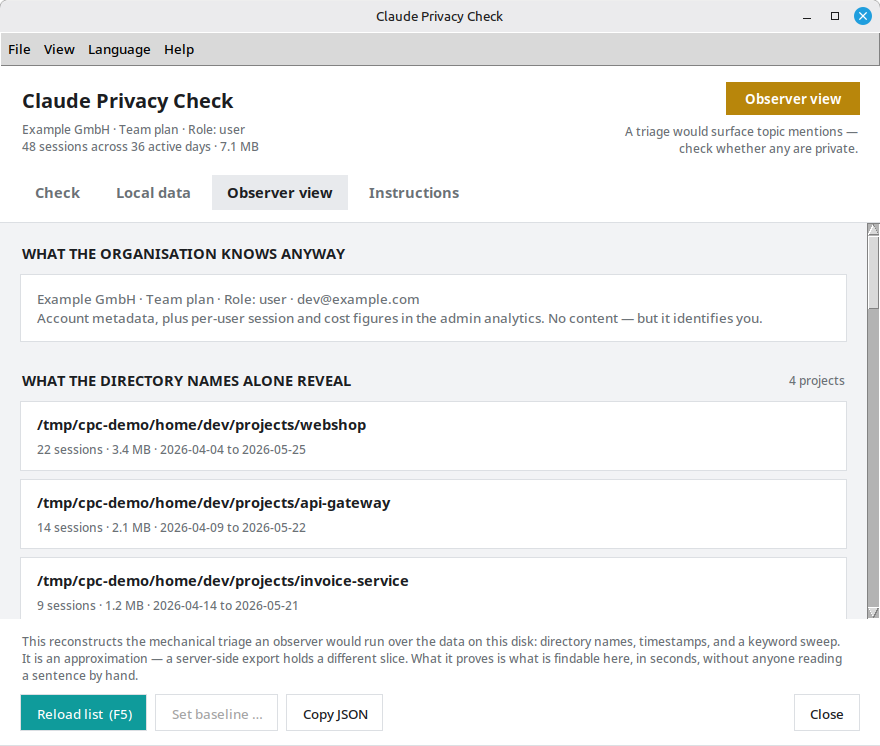
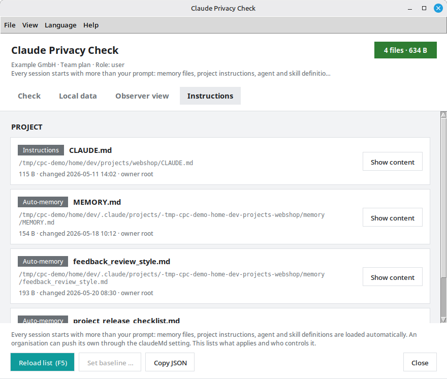
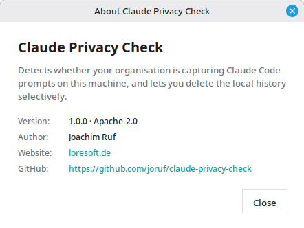

# Claude Privacy Check

Claude Privacy Check tells you whether your organisation is capturing Claude Code
prompts on your machine — and lets you delete the local history selectively. It
also reports whether a usable Claude.ai subscription, API key or cloud-provider
auth is present so Claude Code can run at all.

Under a company Team or Enterprise seat your Claude account belongs to the
organisation. Capturing prompt **content** while you work, though, needs
client-side configuration: telemetry with content logging, a hook, a gateway that
terminates TLS. All of it is visible on disk, and all of it can be pushed
remotely without anyone touching your computer. This tool records a baseline at a
point you trust and tells you when that picture changes.

Python 3.10+, standard library only. Linux.



---

## Read this first: what it cannot do

**A server-side organisation data export by the Primary Owner is not detectable
here.** It runs entirely at Anthropic and leaves no trace on your machine. This
tool answers *"is anything being captured locally?"*, not *"has anyone exported
my data?"*.

Two things follow, and the interface says so as well:

- Deleting local history does not remove the server-side copy, which expires by
  itself after 30 days under commercial terms.
- The baseline is only as trustworthy as your own account. It is no protection
  against someone with root on the machine.

## Install

### Linux

```bash
git clone https://github.com/joruf/claude-privacy-check.git
cd claude-privacy-check
./install.sh
claude-privacy-check --init
```

`install.sh` needs no root and installs nothing system-wide. It puts a symlink in
`~/.local/bin`, adds a menu entry, and checks that Python 3.10+ and Tkinter are
present. Starting `run.py` also checks this and finishes anything still missing —
the window shows each install step as it runs. `--init` records the current state
as the reference point — do that while you still trust the machine.

Without installing anything:

```bash
python3 run.py --init
python3 run.py
```

As a package, if you prefer pip:

```bash
pip install .
```

Removal:

```bash
./install.sh --uninstall
```

That takes the symlink, the menu entry and the monitoring units with it. The
baseline in `~/.local/share/claude-privacy-check/` is kept; delete it by hand if
you want it gone.

The baseline is deliberately stored **outside** the checkout: it holds your
account e-mail, the organisation id and every watched path.

### Requirements

| | |
|---|---|
| Python | 3.10 or newer |
| Window | Tkinter (`python3-tk` on Debian / Ubuntu / Linux Mint) — the command line works without it |
| Monitoring | `systemd --user` and `notify-send`, both standard on desktop installs |
| Dependencies | none |

## What it looks like

The window has six views and a menu bar; the command line does everything the
window does.

### Check — assessment and deviation from the baseline


### Local data — the history on disk, deletable per entry



### Working time — the timesheet those transcripts add up to

### Observer view — what a triage over that data would surface



### Instructions — what is loaded into a session before your prompt



## Features

### What is watched

| Surface | Why it matters |
|---|---|
| `~/.claude/policy-limits.json` | `monitoring_notice`, `compliance_taints` — the server announcing monitoring |
| `~/.claude/remote-settings.json` | pushed from the admin console, highest precedence, needs no root on your machine |
| `/etc/claude-code/managed-settings.json` + `.d/*.json` | IT-enforced configuration |
| Hooks in any settings file | `UserPromptSubmit` and friends can ship prompts elsewhere |
| `apiKeyHelper`, `otelHeadersHelper`, `env` blocks | auth and telemetry injection |
| `OTEL_LOG_USER_PROMPTS`, `_ASSISTANT_RESPONSES`, `_RAW_API_BODIES`, `_TOOL_CONTENT`, `_TOOL_DETAILS` | the actual content-capture switches |
| `ANTHROPIC_BASE_URL`, `NODE_EXTRA_CA_CERTS`, proxy variables | traffic through a gateway that sees everything in the clear |
| `cleanupPeriodDays` | extends local plaintext retention, widening what a later hook could harvest |
| Shell profiles, MCP servers, plugins, file ownership | further injection paths |

Environment variables are read from `/proc/<pid>/environ` of running Claude Code
processes, not just the calling shell — otherwise variables an IDE handed to the
process would stay invisible.

### Deleting local history

Claude Code keeps session transcripts on disk **in plaintext**, 30 days by
default. The tool shows how much there is and removes it: per project, per
individual session, per store (file snapshots, shell snapshots, plans, backups,
session metadata), or all of it.

Guards, each covered by a test:

- only real paths **below `~/.claude`** — resolved with `realpath`, so `..` and
  symlink escapes are caught
- never `~/.claude` itself
- never `.credentials.json`, `settings.json`, `settings.local.json`,
  `policy-limits.json`, `remote-settings.json`
- sessions running right now are detected and flagged in the confirmation

### Working time

Every line a session writes carries a timestamp, to the millisecond. Read in
order they stop describing *what* was worked on and start describing *when*:
start of day, breaks, end of day, the Sunday evening, the hour after midnight.
Nobody set up a time clock. One exists anyway, and it is finer-grained than any
clock a works council ever negotiated over.

This view runs that reconstruction — per day, week, weekday, hour of the day and
project — on the local copy, in this machine's time zone, which is exactly what
anyone holding a copy of the data could run. It is also simply useful: it is the
closest thing to an honest answer to "how long did that actually take".

The method, stated in the interface as well:

- a minute with at least one event counts as a worked minute
- a gap of up to 15 minutes counts as continued work, a longer one as a break
- days are cut at local midnight, the way a timesheet cuts them
- it is a **lower bound** — work without Claude Code leaves no timestamp here,
  and these are figures for activity, not attendance

### Observer view

Volume feels like protection — 200 sessions, hundreds of megabytes, surely nobody
reads that. Nobody does. They search it.

This view runs the triage an observer would: what the directory names give away,
what the timestamps say about your working pattern, and what a keyword sweep
hits. Hits are split into confirmed secret shapes (API keys, tokens, IBANs) and
topic mentions, which in a developer's transcripts fire on ordinary work just as
readily. Saying so is the point — an observer's sweep produces noise too.

It is an approximation, and the interface says so: a server-side export holds a
different slice. What it proves is what is findable here, in seconds.

### Instruction files

Every session starts with more than your prompt. Memory files, project
instructions, agent and skill definitions are loaded automatically — and an
organisation can push its own through the `claudeMd` setting. This view lists
what applies, where it comes from and who owns it, and shows each file. Anything
org-pushed or owned by another user is flagged.

The content of a plain instruction file can be edited in place and saved there —
`Ctrl+S`, or the button. Every body is selectable and has a **Copy** button
whether or not it can be written. What is not editable says why: the org-pushed
`claudeMd` lives in a settings file rather than one of its own, and a file
without write permission, one that is not valid UTF-8 or one over 1 MB is shown
read-only. Writes go through a temporary file next to the target and keep the
file's mode; a symlinked instruction file stays a symlink. A file changed by
something else since it was opened asks before it is overwritten.

### Continuous monitoring

```bash
claude-privacy-check --watch-install              # every 15 minutes + on change
claude-privacy-check --watch-install --interval 5
claude-privacy-check --watch-status
claude-privacy-check --watch-uninstall
```

Three systemd **user** units, no root:

- **`.timer`** — the regular check, 15 minutes by default.
- **`.path`** — inotify on the four configuration files. Fires about a second
  after a change and costs nothing while idle.
- **`.service`** — runs the check and raises the desktop notification.

**Why event-driven and not just a poll:** the watched files are written by the
server at session start — right before you type your first prompt. A notification
a second later reaches you in time; a coarse poll may not.

You are warned only when something actually points at capture: any finding of the
assessment, or a deviation at HIGH or CRITICAL. Harmless deviations stay silent
but remain visible in the interface.

**At most once per session.** The marker lives in
`$XDG_RUNTIME_DIR/claude-privacy-check/`, which the system clears at logout, so a
finding that persists warns you again after the next login but never twice in one
sitting. A genuinely new finding still notifies, because it is new information.

## Command line

```bash
claude-privacy-check                 # graphical interface (default)
claude-privacy-check --license       # GUI: licence / subscription details
claude-privacy-check --cli --license # same, in the terminal
claude-privacy-check --cli           # check against the baseline (terminal)
claude-privacy-check --quiet         # findings of MEDIUM and above only
claude-privacy-check --show          # assess only, do not compare
claude-privacy-check --json          # machine-readable
claude-privacy-check --init          # record a new baseline (overwrites!)

claude-privacy-check --list-data     # local history inventory
claude-privacy-check --delete PATH   # delete below ~/.claude, asks first
claude-privacy-check --cli --worktime      # working time (terminal)
claude-privacy-check --cli --observer      # triage summary (terminal)
claude-privacy-check --cli --instructions  # instruction files (terminal)

claude-privacy-check --data          # GUI: local data view
claude-privacy-check --worktime      # GUI: working time
claude-privacy-check --observer      # GUI: observer view
claude-privacy-check --instructions  # GUI: instructions view
claude-privacy-check --language de   # switch language, remembered
claude-privacy-check --about
```

Exit codes: `0` unchanged · `1` deviation · `2` critical finding — usable in
scripts and monitoring.

Keys in the window: `F5` re-check · `Page ↑/↓`, `Home`/`End` scroll · `Esc` close.

## Language

English by default, German included. The choice sits under **Language** in the
menu bar and is remembered in `~/.config/claude-privacy-check/config.json`.

```bash
claude-privacy-check --language de
```

Adding a language means dropping another JSON file into
`claude_privacy_check/locales/` — no code change. English is the fallback for any
missing key, so a partial translation is still usable. A test keeps the
catalogues in step with the code.

## Layout

```
run.py                            entry point
claude_privacy_check/
├── core.py                       collection, assessment, comparison
├── data.py                       local history inventory and guarded deletion
├── worktime.py                   working time from the transcript timestamps
├── observer.py                   what a triage over that data would surface
├── instructions.py               instruction files loaded into sessions
├── watch.py                      notification and systemd units
├── cli.py                        command line
├── gui.py                        Tkinter (imported only when needed)
├── icons/                        app icon (PNG + SVG)
├── about.py                      version, author, links
├── i18n.py                       translation layer
└── locales/{en,de}.json
tests/                            guards, path decoding, locales, about
packaging/                        desktop entry
```

Findings carry a translation key plus parameters rather than finished text, so
one result object renders in any language. `gui.py` is the only module that
imports Tkinter, and only the GUI path loads it — `--cli` and the other
command-line actions keep working where `python3-tk` is absent.

## Tests

```bash
python3 -m unittest discover -s tests -v
```

## About



Author: **Joachim Ruf** · [loresoft.de](https://loresoft.de) ·
[github.com/joruf/claude-privacy-check](https://github.com/joruf/claude-privacy-check)

## Licence

Apache 2.0 — see [LICENSE](LICENSE).
