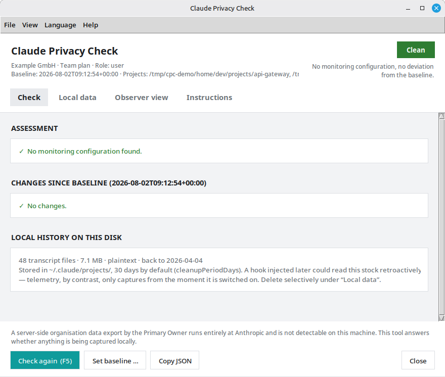
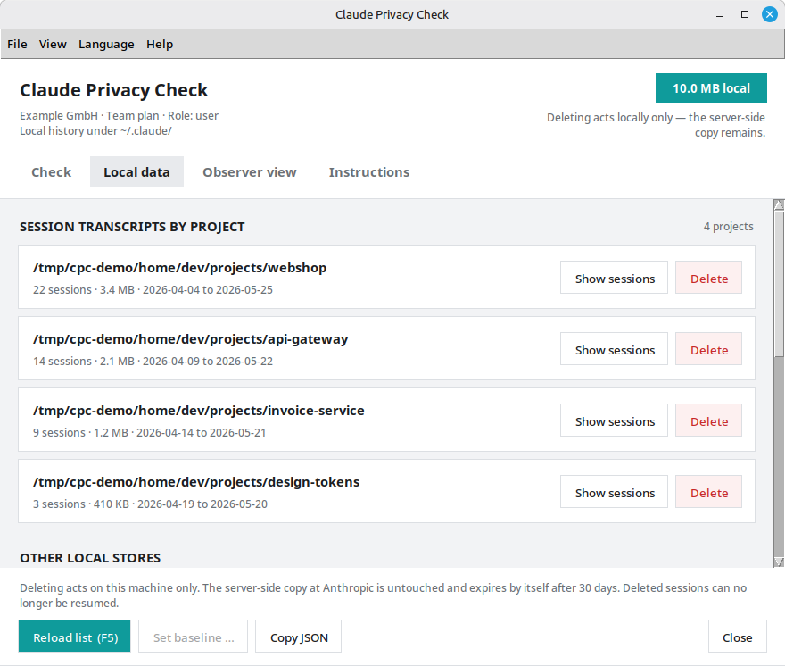
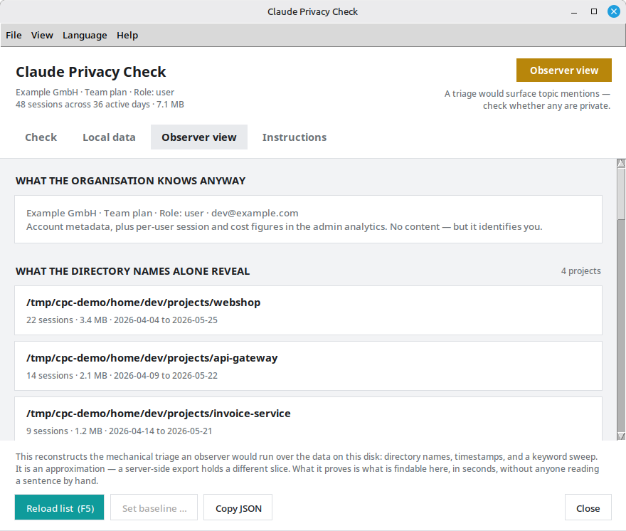
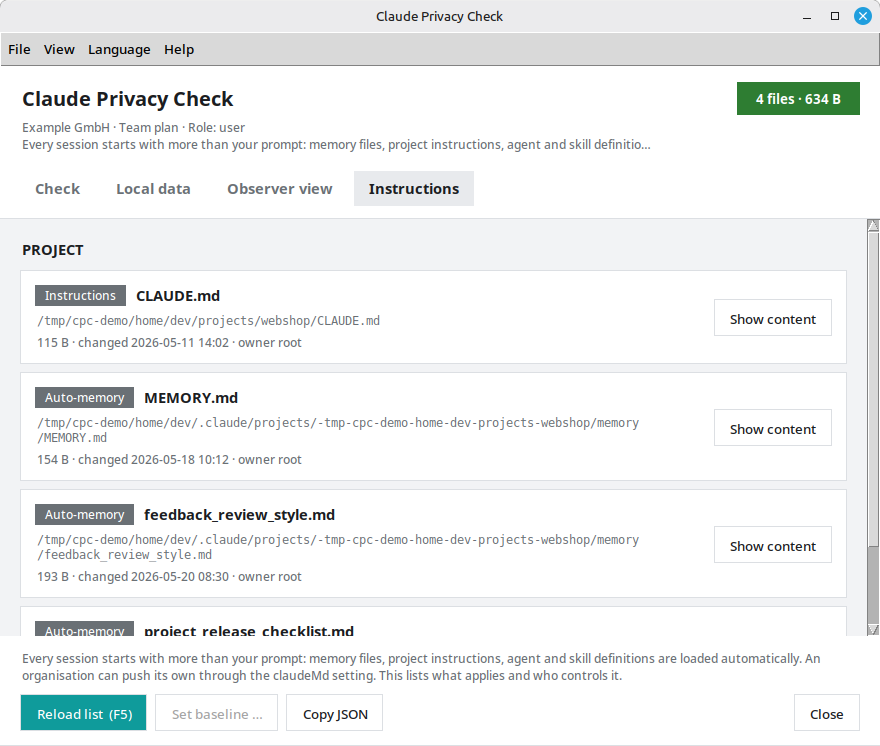
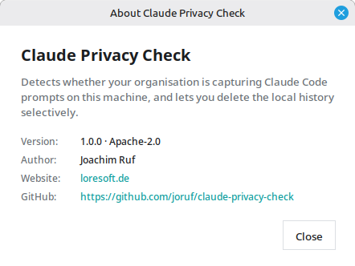

# Claude Privacy Check

Claude Privacy Check tells you whether your organisation is capturing Claude Code
prompts on your machine — and lets you delete the local history selectively. It
also reports whether a usable Claude.ai subscription, API key or cloud-provider
auth is present so Claude Code can run at all.

Under a company Team or Enterprise seat your Claude account belongs to the
organisation. Capturing prompt **content** while you work, though, needs
client-side configuration: telemetry with content logging, a hook, a gateway that
terminates TLS. All of it is visible on disk, and all of it can be pushed
remotely without anyone touching your computer. This tool records a baseline at a
point you trust and tells you when that picture changes.

Python 3.10+, standard library only. Linux.



---

## Read this first: what it cannot do

**A server-side organisation data export by the Primary Owner is not detectable
here.** It runs entirely at Anthropic and leaves no trace on your machine. This
tool answers *"is anything being captured locally?"*, not *"has anyone exported
my data?"*.

Two things follow, and the interface says so as well:

- Deleting local history does not remove the server-side copy, and that copy
  does not expire by itself. Conversations under Claude for Work are kept in the
  product for as long as they exist, and a Claude Code session captured through
  the Enterprise Compliance API is kept for **6 years** by default. Anthropic's
  own comparison grants remote sessions "6 years, unless a user deletes the
  session sooner"; the local session column has no such clause, and local
  sessions carry no `deleted_at` field at all. The 30 days in this README refer
  to the **local** transcript sweep (`cleanupPeriodDays`), nothing else.
- The baseline is only as trustworthy as your own account. It is no protection
  against someone with root on the machine.

## Install

### Linux

```bash
git clone https://github.com/joruf/claude-privacy-check.git
cd claude-privacy-check
./install.sh
claude-privacy-check --init
```

`install.sh` needs no root and installs nothing system-wide. It puts a symlink in
`~/.local/bin`, adds a menu entry, and checks that Python 3.10+ and Tkinter are
present. Starting `run.py` also checks this and finishes anything still missing —
the window shows each install step as it runs. `--init` records the current state
as the reference point — do that while you still trust the machine.

Without installing anything:

```bash
python3 run.py --init
python3 run.py
```

As a package, if you prefer pip:

```bash
pip install .
```

Removal:

```bash
./install.sh --uninstall
```

That takes the symlink, the menu entry and the monitoring units with it. The
baseline in `~/.local/share/claude-privacy-check/` is kept; delete it by hand if
you want it gone.

The baseline is deliberately stored **outside** the checkout: it holds your
account e-mail, the organisation id and every watched path.

### Requirements

| | |
|---|---|
| Python | 3.10 or newer |
| Window | Tkinter (`python3-tk` on Debian / Ubuntu / Linux Mint) — the command line works without it |
| Monitoring | `systemd --user` and `notify-send`, both standard on desktop installs |
| Dependencies | none |

## What it looks like

The window has nine views and a menu bar; the command line does everything the
window does.

### Check — assessment and deviation from the baseline


### Local data — the history on disk, deletable per entry



### Working time — the timesheet those transcripts add up to

### Admin dashboard — the row your organisation already sees

### Names and paths — what the conversations carry besides your sentences

### Observer view — what a triage over that data would surface



### Telemetry — the events queued to leave this machine

### Instructions — what is loaded into a session before your prompt



## Features

### What is watched

| Surface | Why it matters |
|---|---|
| `~/.claude/policy-limits.json` | `monitoring_notice`, `compliance_taints` — the server announcing monitoring |
| `~/.claude/remote-settings.json` | pushed from the admin console, highest precedence, needs no root on your machine |
| `/etc/claude-code/managed-settings.json` + `.d/*.json` | IT-enforced configuration |
| Hooks in any settings file | `UserPromptSubmit` and friends can ship prompts elsewhere |
| `apiKeyHelper`, `otelHeadersHelper`, `env` blocks | auth and telemetry injection |
| `OTEL_LOG_USER_PROMPTS`, `_ASSISTANT_RESPONSES`, `_RAW_API_BODIES`, `_TOOL_CONTENT`, `_TOOL_DETAILS` | the actual content-capture switches |
| `ANTHROPIC_BASE_URL`, `NODE_EXTRA_CA_CERTS`, proxy variables | traffic through a gateway that sees everything in the clear |
| `cleanupPeriodDays` | extends local plaintext retention, widening what a later hook could harvest |
| Shell profiles, MCP servers, plugins, file ownership | further injection paths |
| `~/.claude/telemetry/*.json` | the outbound event queue — the payload itself, not a setting that describes it |

Environment variables are read from `/proc/<pid>/environ` of running Claude Code
processes, not just the calling shell — otherwise variables an IDE handed to the
process would stay invisible.

### The outbound telemetry queue

Every other check here reads *configuration* — what could be captured if someone
switched it on. This one reads the payload. Claude Code keeps its own first-party
events under `~/.claude/telemetry`, JSON per line, in the clear, and that is the
one place where "nothing of mine leaves this machine" can be held against
evidence instead of against a settings file.

**It is the retry queue.** The files are named `1p_failed_events.*`: events whose
delivery failed, kept for another attempt. A successful one leaves no copy
behind. So it is a sample of the payload's shape, never a complete send log, and
an empty directory proves nothing. The interface says so in the view itself.

What the view reports:

- **A content scan** for this machine's home path and user name, its project
  names, the account address and literal credential shapes. Encoded fields are
  decoded *first* — two of them carry a nested JSON object that a plain text
  search walks straight past, which makes them the obvious hiding place. A hit
  is CRITICAL, feeds the exit code and raises the desktop notification; unlike
  the transcript sweep there is no harmless hit here, because product telemetry
  has no reason to carry any of it.
- **A credential is reported by the pattern that matched, never by the value.**
  Printing it would make the report the second place it exists. For the same
  reason the baseline records counts only — no excerpts, no matched literals.
- **What identifies the machine**: operating system, distribution, kernel, shell,
  which editor started the session. No project name can be read out of these. A
  change of computer is visible in them.
- **What identifies the account**, and a check the label alone will not give you:
  the field named `device_id` is compared against both `userID` and `machineID`
  from `~/.claude.json`, and the view states which one it actually holds.
- **Names you chose yourself.** Skills, subagents and slash commands are counted
  by name, and those names were typed on this machine. Nothing is wrong with
  that — it is how a skill load gets counted — but a name is free text, and
  people put a company, a client or a project codename in one. Matched against
  whole field values, so a two-letter command name is as findable as a long one
  and nothing matches by accident.
- **The complete payload structure**: every field that appears anywhere in the
  queue, with an example value. That is the whole of what an event can carry.
  There is no second, hidden part.

A queue that scans clean still produces an INFO finding naming what was examined.
A surface that was checked and came back negative should say so rather than
vanish into an empty list.

### Deleting local history

Claude Code keeps session transcripts on disk **in plaintext**, 30 days by
default. The tool shows how much there is and removes it: per project, per
individual session, per store (file snapshots, shell snapshots, plans, backups,
session metadata), or all of it.

Guards, each covered by a test:

- only real paths **below `~/.claude`** — resolved with `realpath`, so `..` and
  symlink escapes are caught
- never `~/.claude` itself
- never `.credentials.json`, `settings.json`, `settings.local.json`,
  `policy-limits.json`, `remote-settings.json`
- sessions running right now are detected and flagged in the confirmation

### Working time

Every line a session writes carries a timestamp, to the millisecond. Read in
order they stop describing *what* was worked on and start describing *when*:
start of day, breaks, end of day, the Sunday evening, the hour after midnight.
Nobody set up a time clock. One exists anyway, and it is finer-grained than any
clock a works council ever negotiated over.

This view runs that reconstruction — per day, week, weekday, hour of the day and
project — on the local copy, in this machine's time zone, which is exactly what
anyone holding a copy of the data could run. It is also simply useful: it is the
closest thing to an honest answer to "how long did that actually take".

The method, stated in the interface as well:

- a minute with at least one event counts as a worked minute
- a gap of up to 15 minutes counts as continued work, a longer one as a break
- days are cut at local midnight, the way a timesheet cuts them
- it is a **lower bound** — work without Claude Code leaves no timestamp here,
  and these are figures for activity, not attendance

### Admin dashboard

The other views ask what is being captured *on this machine*. This one asks the
opposite question, and it is the one people actually want answered: **what does
the organisation already see, without capturing anything at all?**

On a Team or Enterprise seat the answer is a dashboard. Owners and Primary
Owners open Analytics and get active members, adoption, product stickiness,
"how agentic is their work?", top members by chats and artifacts, a Claude Code
leaderboard by lines of code, spend concentration, and a per-user, per-model CSV
with request counts and token counts in it. None of it is conversation content.
All of it is about a named person.

This view rebuilds that row from the local transcripts, so the figures stop
being an abstraction:

- **The spend report**, one line per model, under the field names the export
  actually uses (`total_requests`, `total_prompt_tokens`,
  `total_completion_tokens`), plus the month-to-month curve.
- **Top spenders and spend concentration** — cost per session, per active day
  and per prompt.
- **The Claude Code leaderboard** — lines of code accepted, and what cannot be
  had locally: a rejected suggestion leaves no trace, so there is no accept
  rate, and "PRs with Claude Code" stays empty until an owner connects the
  GitHub app.
- **How agentic is their work?** — tool calls per typed prompt, delegations to
  subagents, and the skill names. Those names are free text you chose yourself
  and they travel into the statistics as field values. Next to the ratio sits
  the breakdown the tile does not show: how many of those calls only looked and
  verified, and how many actually wrote something. That split is what decides
  whether a high ratio reads as leverage or as somebody who stopped looking.
- **Projects**, with the distinction the dashboard blurs: "Projects" there means
  the claude.ai project feature, while the working directories below it live in
  the organisation data export, because every transcript carries its `cwd`.
- **Working pattern** — off-hours, nights, weekends, the strongest weekday, the
  hour after midnight. Not a dashboard tile, but one hour with the data export
  produces it.

**Both readings, for the same figure.** A number alone does not tell a person
what it will do to them, so the view ends with the two readings every figure on
the page carries: what it argues for you, and what it argues against you. The
consumption that proves the tool is being used is the same consumption that puts
your name at the top of spend concentration; the working hours that show
commitment are the same hours that read as a personnel file. Underneath it, what
follows: that the values are produced server-side and cannot be deleted away,
what a prepared explanation would consist of in your own figures, and that
lowering the ratio is possible, is a bad trade, and is still your decision.

Three limits, stated in the view as well:

- **Claude Code only.** Chats on claude.ai, artifacts made there, Cowork and
  Design leave nothing on this disk; those rows are not reconstructed.
- **A lower bound.** A session deleted locally is gone from this count and still
  counted server-side.
- **Spend is list price.** The token counts are what happened; the money column
  is those tokens at the published per-model rate (cache writes at 1.25x input,
  cache reads at 0.10x). On a seat-based plan nobody is invoiced for it, and the
  dashboard shows the number anyway. A model with no published rate is reported
  as unpriced rather than quietly valued at zero.

### Names and paths

Two things travel inside a session that nobody types as a message, and both are
more revealing than the sentences around them.

**The name you gave the tab.** It is not a label on the surface. It is written
into the transcript as a record of its own (`{"type": "custom-title", ...}`),
into a `custom-title.json` beside it, into `~/.claude/sessions/<pid>.json`, and
into the editor extension's log — four places, and the view names all four,
because deleting a name means visiting each. Read as a list, those names are an
inventory of what you worked on, and nothing in it separates the company's
projects from your own. `formerNames` is worth its own line: renaming a tab does
not replace the old name, it files it.

Each row in both tables has a **Delete locally** button. It removes the
conversations that carry that entry, through the same guards as every other
deletion here, and the dialog says twice what it does not do. Whole files only:
nothing is cut out of a transcript, because a rewritten transcript breaks
`--resume` and changes nothing on the server. Deleting a row that names
`.../pmtool/.env` removes the *conversations that mention it*, never the file
itself — pinned by a test, because getting that backwards would delete the
user's own credentials file.

**The file you had open in the editor.** While the extension is connected, the
absolute path of the active editor tab is appended to your prompt, whether or
not the file has anything to do with the question. The view lists those paths by
how often they appeared, and marks the ones whose *name alone* gives their kind
away — `.env`, `id_rsa`, `credentials.json`, `*.pem`. A hit does not mean the
contents left; it means the sentence "this person had that file open" did. The
rule is deliberately narrow: a noun has to begin a path segment, so a
`TokenParser.php` is not flagged and the list stays worth reading.

What the view claims, and what it refuses to claim:

- **Certain, and readable right here:** the name is a record *inside* the
  conversation file rather than a setting beside it, and the opened-file path is
  part of the prompt text.
- **Not decidable from this machine:** whether the server-side copy carries the
  same records, and so whether an organisation data export contains them.
  Something living inside the conversation is far more likely to travel with it
  than a local setting, so the view says assume it travels.

### Observer view

Volume feels like protection — 200 sessions, hundreds of megabytes, surely nobody
reads that. Nobody does. They search it.

This view runs the triage an observer would: what the directory names give away,
what the timestamps say about your working pattern, and what a keyword sweep
hits. Hits are split into confirmed secret shapes (API keys, tokens, IBANs) and
topic mentions, which in a developer's transcripts fire on ordinary work just as
readily. Saying so is the point — an observer's sweep produces noise too.

It is an approximation, and the interface says so: a server-side export holds a
different slice. What it proves is what is findable here, in seconds.

### Instruction files

Every session starts with more than your prompt. Memory files, project
instructions, agent and skill definitions are loaded automatically — and an
organisation can push its own through the `claudeMd` setting. This view lists
what applies, where it comes from and who owns it, and shows each file. Anything
org-pushed or owned by another user is flagged.

The content of a plain instruction file can be edited in place and saved there —
`Ctrl+S`, or the button. Every body is selectable and has a **Copy** button
whether or not it can be written. What is not editable says why: the org-pushed
`claudeMd` lives in a settings file rather than one of its own, and a file
without write permission, one that is not valid UTF-8 or one over 1 MB is shown
read-only. Writes go through a temporary file next to the target and keep the
file's mode; a symlinked instruction file stays a symlink. A file changed by
something else since it was opened asks before it is overwritten.

### Continuous monitoring

```bash
claude-privacy-check --watch-install              # every 15 minutes + on change
claude-privacy-check --watch-install --interval 5
claude-privacy-check --watch-status
claude-privacy-check --watch-uninstall
```

Three systemd **user** units, no root:

- **`.timer`** — the regular check, 15 minutes by default.
- **`.path`** — inotify on the four configuration files. Fires about a second
  after a change and costs nothing while idle.
- **`.service`** — runs the check and raises the desktop notification.

**Why event-driven and not just a poll:** the watched files are written by the
server at session start — right before you type your first prompt. A notification
a second later reaches you in time; a coarse poll may not.

You are warned only when something actually points at capture: a finding or a
deviation at HIGH or CRITICAL. Everything quieter — a paid plan, the length of
the telemetry queue, your own settings, permissions, plugins — stays silent and
remains visible in the interface. Three rules keep the alarm rare enough to be
worth reading:

- **A value that vanished is not a value that appeared.** A `monitoring_notice`
  going from a text to nothing, or a key disappearing while its file is
  rewritten, is capped at MEDIUM. The path alone decides how loud a change is
  only while something is actually set there.
- **A file being written is not a broken file.** The watch reacts to the write
  itself, so a settings file is re-read twice before a parse failure counts, and
  one that is simply empty is read as empty rather than as damaged.
- **Standing state never notifies.** It belongs in the report, not in a popup —
  and it kept the volatile queue length out of the "is this new?" comparison,
  which used to make every changed count look like a new event.

**At most once per session.** The marker lives in
`$XDG_RUNTIME_DIR/claude-privacy-check/`, which the system clears at logout, so a
finding that persists warns you again after the next login but never twice in one
sitting. A genuinely new finding still notifies, because it is new information.

## Command line

```bash
claude-privacy-check                 # graphical interface (default)
claude-privacy-check --license       # GUI: licence / subscription details
claude-privacy-check --cli --license # same, in the terminal
claude-privacy-check --cli           # check against the baseline (terminal)
claude-privacy-check --quiet         # findings of MEDIUM and above only
claude-privacy-check --show          # assess only, do not compare
claude-privacy-check --json          # machine-readable
claude-privacy-check --init          # record a new baseline (overwrites!)

claude-privacy-check --list-data     # local history inventory
claude-privacy-check --delete PATH   # delete below ~/.claude, asks first
claude-privacy-check --cli --worktime      # working time (terminal)
claude-privacy-check --cli --analytics     # the admin dashboard (terminal)
claude-privacy-check --cli --names         # tab names and opened files (terminal)
claude-privacy-check --cli --observer      # triage summary (terminal)
claude-privacy-check --cli --telemetry     # outbound queue (terminal)
claude-privacy-check --cli --instructions  # instruction files (terminal)

claude-privacy-check --data          # GUI: local data view
claude-privacy-check --worktime      # GUI: working time
claude-privacy-check --analytics     # GUI: admin dashboard
claude-privacy-check --names         # GUI: names and paths
claude-privacy-check --observer      # GUI: observer view
claude-privacy-check --telemetry     # GUI: outbound telemetry queue
claude-privacy-check --instructions  # GUI: instructions view
claude-privacy-check --language de   # switch language, remembered
claude-privacy-check --about
```

Exit codes: `0` unchanged · `1` deviation · `2` critical finding — usable in
scripts and monitoring.

Keys in the window: `F5` re-check · `Page ↑/↓`, `Home`/`End` scroll · `Esc` close.

## Language

English by default, German included. The choice sits under **Language** in the
menu bar and is remembered in `~/.config/claude-privacy-check/config.json`.

```bash
claude-privacy-check --language de
```

Adding a language means dropping another JSON file into
`claude_privacy_check/locales/` — no code change. English is the fallback for any
missing key, so a partial translation is still usable. A test keeps the
catalogues in step with the code.

## Layout

```
run.py                            entry point
claude_privacy_check/
├── core.py                       collection, assessment, comparison
├── data.py                       local history inventory and guarded deletion
├── worktime.py                   working time from the transcript timestamps
├── analytics.py                  the dashboard row the organisation sees
├── names.py                      tab names and opened-file paths in the transcripts
├── observer.py                   what a triage over that data would surface
├── instructions.py               instruction files loaded into sessions
├── watch.py                      notification and systemd units
├── cli.py                        command line
├── gui.py                        Tkinter (imported only when needed)
├── icons/                        app icon (PNG + SVG)
├── about.py                      version, author, links
├── i18n.py                       translation layer
└── locales/{en,de}.json
tests/                            guards, path decoding, locales, about
packaging/                        desktop entry
```

Findings carry a translation key plus parameters rather than finished text, so
one result object renders in any language. `gui.py` is the only module that
imports Tkinter, and only the GUI path loads it — `--cli` and the other
command-line actions keep working where `python3-tk` is absent.

## Tests

```bash
python3 -m unittest discover -s tests -v
```

## About



Author: **Joachim Ruf** · [loresoft.de](https://www.loresoft.de) ·
[github.com/joruf/claude-privacy-check](https://github.com/joruf/claude-privacy-check)

## Licence

Apache 2.0 — see [LICENSE](LICENSE).
